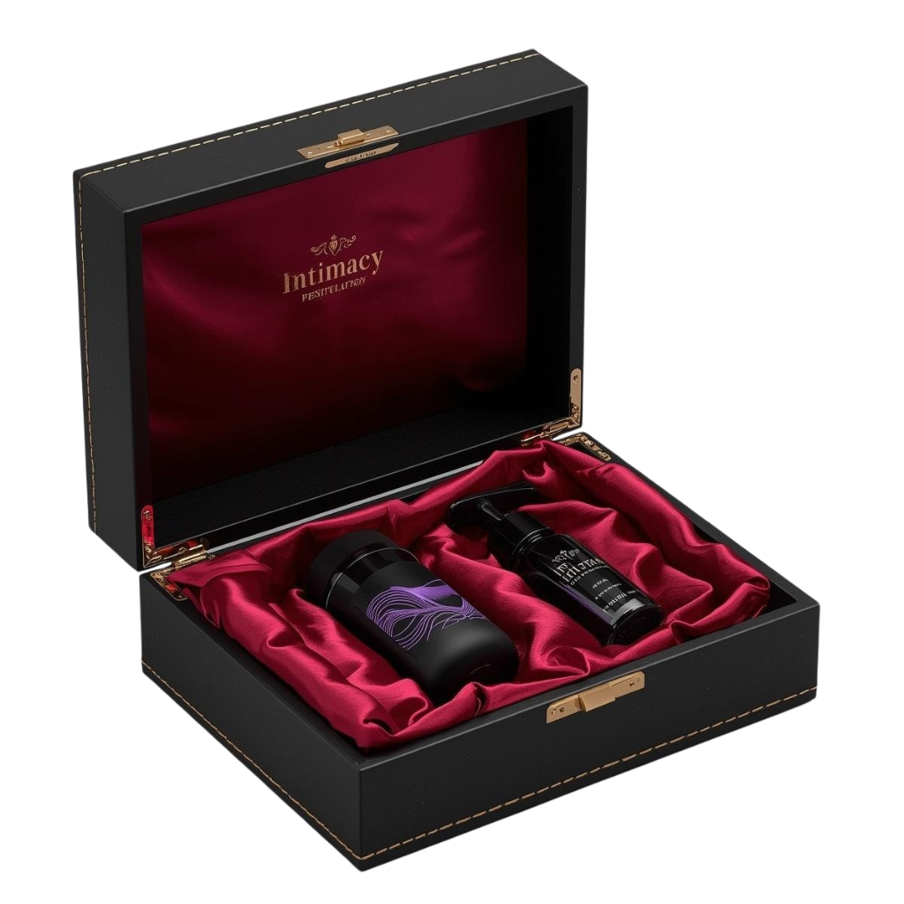

# Proposta de Projeto: Intimidade 🖤
*Bem-Estar, Conexão e Luxo para Casais*

---

## 1. O Conceito (The Core Idea)
A **Intimidade** não é apenas um "sex shop". É uma marca de **Sexual Wellness** focada em casais que buscam sair da rotina e redescobrir a conexão através de experiências sensoriais. O foco é o romantismo, o conforto e o prazer compartilhado, evitando o tom vulgar das lojas tradicionais.

---

## 2. Identidade Visual (Design System)
Para justificar um ticket médio elevado (R$ 200 - R$ 500+), adotamos a estética **Dark Luxury**:
*   **Cores:** Preto Carvão, Dourado Metálico e Vermelho Bordeaux (inspirado no cetim).
*   **Logo:** Um emblema tipográfico refinado (um "I" entalhado em um selo circular dourado).
*   **Sensação:** Mistério, sofisticação e segurança.

---

## 3. O Site (A Vitrine de Alta Conversão)
O site foi projetado para vender a *experiência*, não apenas o produto:
*   **Quiz de Conexão:** Um funil interativo que ajuda o casal a descobrir o kit ideal com base no clima da noite.
*   **Lead Magnet:** Disponibilização gratuita de um "Joguinho da Conexão" para capturar contatos.
*   **Venda Humanizada:** Direcionamento estratégico para WhatsApp, permitindo consultoria personalizada.

---

## 4. Sugestão de Kits (Curation)
*   **Kit Essencial (Entrada):** Foco em toques e vibração compartilhada.
*   **Kit Exploração Sensorial (Intermediário):** Foco em texturas, velas e massagem.
*   **Kit Noite de Gala (Premium):** A experiência completa com luxo e surpresa.

---

## 5. Estratégia de Marketing (Instagram "Safe")
Quatro pilares de posts desenhados para engajar sem violar as diretrizes da plataforma:

### 📱 Post 1: A Pergunta Desconfortável
**Conceito:** Gerar identificação com a rotina.
*   **Slide 1:** "Quando foi a última vez que vocês fizeram algo pela primeira vez?"
*   **Slide 2:** A rotina é o maior vilão da intimidade. O sofá e o cansaço viram o padrão.
*   **Legenda:** Se você teve que pensar muito, esse é o seu sinal. A mágica acontece fora da mesmice.

### 📱 Post 2: O Mito do "Date Caro"
**Conceito:** Mostrar que a conexão pode ser em casa.
*   **Texto na Tela:** "O date perfeito não precisa de uma reserva cara."
*   **Legenda:** Você não precisa sair de casa para fugir da rotina. Precisa de intenção e o estímulo certo.

### 📱 Post 3: O Poder do Toque
**Conceito:** Focar na cosmética sensorial (Velas/Óleos).
*   **Texto na Tela:** "O que acontece quando você troca o celular por um toque com intenção?"
*   **Legenda:** Nossa vela derrete e se transforma num óleo de massagem morno. O toque reconecta.

### 📱 Post 4: O Unboxing do Mistério
**Conceito:** Mostrar a caixa premium (Conversão).
*   **Texto na Tela:** "Não dê um presente, entregue uma memória."
*   **Legenda:** Curadoria de alto padrão em embalagem discreta. A mágica está no que vem dentro.

---

## 6. Próximos Passos
1. Configuração dos links oficiais (Mercado Livre/Shopee/WhatsApp).
2. Hospedagem do domínio `intimidade.com.br`.
3. Produção da primeira leva de kits com fornecedores parceiros (Intt, Lubs, Kalya).

---
*Este documento resume a fundação estratégica da marca Intimidade.*
